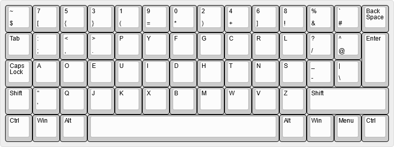

# programmer-dvorak-matrix

 
There haven't seemed to have been any other examples of this online so I created my own for reference.
 
The Ctrl level for Ctrl+[, Ctrl+], and Ctrl+\ have been moved to their respective numeric keys.
 
Capslock also shifts the numrow.
 
The altgr level has not been carried over.
 
# Building
Compilation requires Microsoft Keyboard Layout Creator (MSKLC) which can be obtained from the link below:
 
https://www.microsoft.com/en-us/download/details.aspx?id=102134
